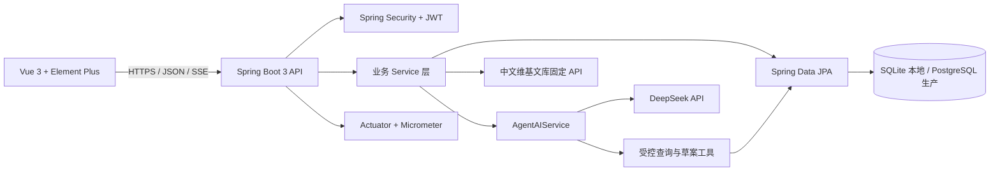
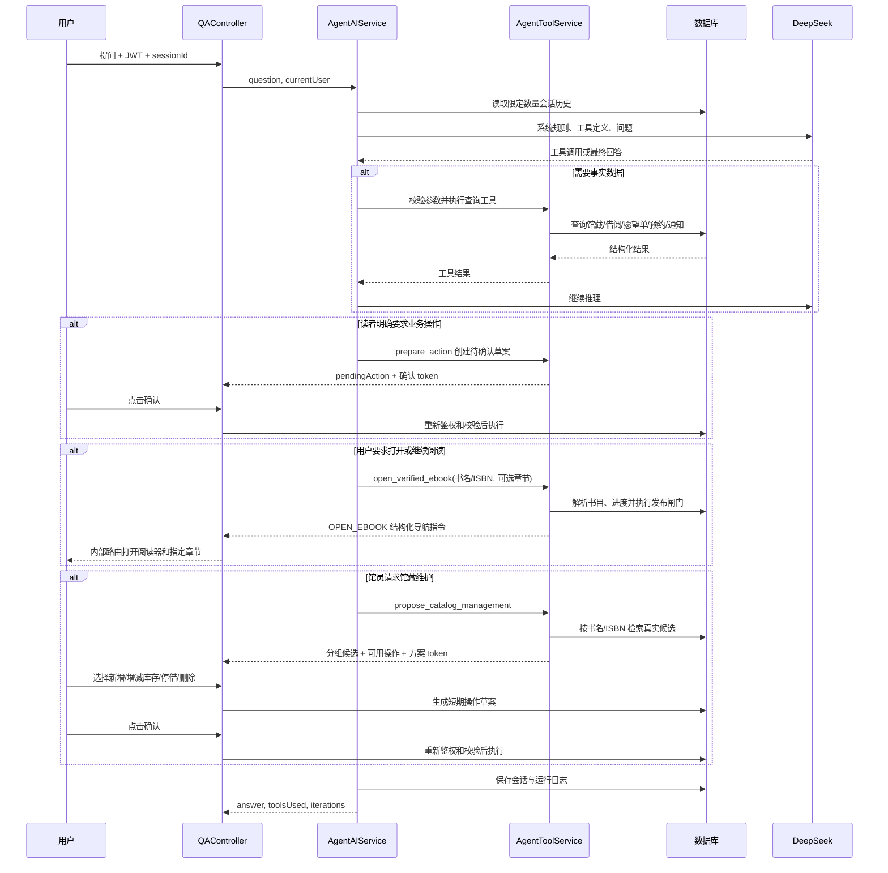

# 智能图书管理系统项目说明书

> 项目版本：1.0.0  
> 文档版本：3.3  
> 更新日期：2026-08-19

## 1. 项目定位

本项目是一个面向读者与馆员的前后端分离图书流通系统，覆盖馆藏检索、借还书、愿望单、后台管理、审计日志和 AgentAI 图书助手。它的目标不是演示单一 CRUD，而是展示一个 Java Web 项目从业务一致性、安全、可观测性到容器化交付的完整闭环。

读者使用 Vue 页面完成检索、借还、续借、预约和通知处理；馆员维护馆藏并查看流通数据；管理员进一步管理用户和角色；Agent 通过受控工具查询真实业务数据、打开已核验古典原文，并为有限的写操作生成待用户确认的短期草案。

## 2. 功能范围

| 模块 | 已实现能力 |
|---|---|
| 身份认证 | JWT 无状态认证、`USER` / `LIBRARIAN` / `ADMIN` 三级角色、账号启停、BCrypt 密码校验 |
| 馆藏管理 | 图书搜索、详情、相似推荐、后台增改删、库存增减、可借状态维护、引用保护删除 |
| 借阅流转 | 借阅、归还、续借、到期日、逾期查询、个人与全局借阅记录 |
| 预约与通知 | 无库存排队预约、到书保留、取消预约、到期/逾期/到书站内通知 |
| 个人中心 | 愿望单、借阅历史、当前用户数据隔离 |
| 合规阅读 | 4 部公版古典原文、章节阅读器、阅读进度、来源/许可署名、双层发布闸门、紧急下架 |
| 运营管理 | 分类借阅统计、操作审计日志 |
| AgentAI | 工具调用、会话历史、SSE、查询工具、合规原文受控跳转、馆藏多方案、操作草案与二次确认 |
| 工程化 | 参数校验、统一错误协议、OpenAPI、Actuator、Flyway、Docker Compose、CI |

## 3. 架构设计



后端按 Controller、Service、Repository、Entity/DTO 分层。Controller 负责协议、认证上下文和参数校验；Service 承担业务规则和事务；Repository 负责持久化；`AgentAIService` 负责编排大模型与工具，写操作必须先落为短期草案，再经过当前用户确认和服务端二次校验。

## 4. 技术栈

| 类别 | 技术 |
|---|---|
| 前端 | Vue 3、Vue Router、Pinia、Element Plus、Axios、Vue CLI |
| 后端 | Java 21、Spring Boot 3.2、Spring MVC、Spring Security、Spring Validation、jsoup |
| 数据 | Spring Data JPA / Hibernate、SQLite（local）、PostgreSQL（prod）、Flyway |
| AI | DeepSeek Chat API、OkHttp、结构化工具调用 |
| 运维 | Spring Boot Actuator、Micrometer、springdoc OpenAPI、Docker Compose、GitHub Actions |
| 测试 | JUnit 5、Mockito、Spring Boot Test |

## 5. 核心业务与一致性

### 5.1 借阅事务

借阅流程在一个事务内执行：

1. 以悲观锁读取当前用户，串行化该用户的借阅额度判断。
2. 校验图书存在、可借、未重复借阅及“最多 5 本”的规则。
3. 执行带条件的原子库存更新：只有 `borrowed_count < total_count` 时才增加已借数量。
4. 写入 `BORROWED` 借阅记录和审计日志。

归还流程同样在事务中将有效借阅记录标为 `RETURNED`，并通过 `borrowed_count > 0` 条件更新库存。这样即使两个请求同时抢最后一本书，也只有一个请求成功，另一个返回 `409 / BOOK_OUT_OF_STOCK`，防止超借和负库存。

### 5.2 数据约束

生产数据库由 `backend/src/main/resources/db/migration` 下的 Flyway 脚本演进。V1 创建核心表，V2 增加预约、通知和 Agent 草案，V3 增加 Agent 馆藏方案并扩展草案动作类型，V4 增加合规电子资源与阅读进度。主要约束包括：

- `books` 的库存范围约束：`0 <= borrowed_count <= total_count`；
- `wish_list(user_id, isbn)` 唯一约束，保证愿望单幂等；
- 借阅、会话和日志的外键与查询索引；
- 借阅状态、用户角色的检查约束。
- 电子资源只有在权属状态、来源、许可证、核验依据和内容声明齐备时才允许标记为已发布。

生产环境 Hibernate 使用 `ddl-auto=validate`，只校验而不自动改表；表结构演进由 Flyway 版本化迁移管理。

### 5.3 预约、续借与通知

预约状态机：

```text
WAITING -> NOTIFIED -> COMPLETED
                    -> EXPIRED
WAITING / NOTIFIED -> CANCELLED
```

无库存时读者进入按时间排序的预约队列。图书归还或已通知预约取消后，系统根据可用副本数量通知下一位读者，并保留 48 小时。续借要求图书未逾期、未达到续借上限且没有其他读者排队。

通知使用数据库落库和 Spring `@Scheduled` 周期扫描，不依赖 RabbitMQ。每条到期、逾期和预约通知带有业务唯一键，因此任务重复执行不会重复生成同一条消息。

### 5.4 合规数字阅读

首批阅读资源只包括《红楼梦》《三国演义》《水浒传》《西游记》的古典原文。系统明确排除现代出版社的校注、译文、插图、封面和版式，不把纸书出版社信息误认为电子版授权。权属依据和逐项来源记录在 `docs/电子资源版权清单.md`。

访问正文前会执行两层发布闸门：数据库约束保证发布记录的必要字段不为空；`EbookService` 再校验固定权属状态、作者逝世年份、首次发表年份、中文维基文库域名、固定章节规则和 CC BY-SA 4.0 许可。任一条件不满足就返回 403/404，不会降级为未经核验的全文。

正文只通过服务端固定的中文维基文库 API 拉取，不接受用户提交的 URL。后端使用 jsoup 移除脚本、样式、表单、图片和非正文控件，并用允许列表重新构造 HTML；前端在独立固定视口阅读器中展示，持续保留来源、署名、许可证链接和修改说明。阅读进度按 JWT 当前用户隔离。管理员或馆员发现异常后可通过单向接口立即下架，恢复发布需要重新走数据核验流程。

## 6. AgentAI 设计



Agent 的独特性在于“规划 -> 调工具 -> 基于结果回答”的闭环，不是把用户问题直接转发给模型。其安全边界包括：

- 工具注册表提供检索、详情、统计、当前用户借阅/愿望单/预约/通知等查询能力，以及不直接执行写入的 `prepare_action`、`propose_catalog_management` 和只返回受控内部导航的 `open_verified_ebook`；
- 阅读跳转不信任模型提供的 URL。服务端按真实书目、当前用户进度和完整电子资源发布闸门生成 `OPEN_EBOOK` 指令，前端再次校验类型、ISBN 和章节边界后才进入阅读器；现代图书或未核验资源不会产生跳转；
- 个人数据工具绑定 JWT 当前用户，不能由提示词替换用户身份；
- 馆藏方案一次最多处理 5 个书名，每组最多返回 5 个真实候选，令牌 5 分钟有效；候选 ISBN、查询词和创建人均由服务端验证；
- 馆员可新增、增减库存、停借和恢复，只有管理员可彻底删除；存在借阅、预约、愿望单或推荐关系的书目禁止硬删除；
- 任何管理选择都先生成草案；确认时重新读取当前账号角色、库存和引用状态，模型本身没有直接写库权限；
- 参数通过 JSON Schema 和服务端约束校验；
- 单轮限制工具调用和规划循环次数，避免无限循环；
- 会话历史受条数限制；模型与工具异常会记录并以标准错误响应返回；
- Agent 运行使用 Micrometer Observation 记录，可在管理员指标端点观测；草案确认和取消均进入审计日志。

## 7. 安全设计

- JWT 密钥和 DeepSeek Key 只从环境变量读取，源码、前端包和接口响应均不包含密钥。
- 生产启动必须设置 `JWT_SECRET`；建议使用至少 48 个随机字节并在部署平台 Secret 中保存。
- CORS 白名单由 `APP_CORS_ALLOWED_ORIGINS` 配置，默认仅允许本地前端。
- 无效、过期或格式错误的 JWT 不会使过滤器抛出未处理异常，而是进入统一的 401 响应。
- `LIBRARIAN` 可以维护馆藏和查看流通数据；只有 `ADMIN` 可以管理账号、彻底删除书目和访问 Actuator 指标。
- JWT 每次请求都会重新读取账号启用状态和当前角色，停用账号或调整角色后无需等待旧令牌过期。
- DTO 对登录、图书创建和 Agent 问题等入口字段进行长度、非空和格式校验。

## 8. 环境与配置

### 8.1 配置文件

| 文件 | 用途 |
|---|---|
| `application.yml` | 共享配置：端口、JWT、借阅规则、Actuator、OpenAPI |
| `application-local.yml` | 默认本地环境：SQLite、`ddl-auto=update`、Flyway 关闭、演示数据开启 |
| `application-prod.yml` | 生产环境：PostgreSQL、Hikari 连接池、Flyway、`ddl-auto=validate`、演示数据默认关闭 |
| `.env.example` | Docker Compose 环境变量示例，不含真实密钥 |

### 8.2 必要环境变量

| 变量 | 必填 | 说明 |
|---|---:|---|
| `JWT_SECRET` | 是 | JWT HMAC 密钥 |
| `DEEPSEEK_API_KEY` | Agent 功能需要 | DeepSeek API 密钥；未配置时 Agent 不可用 |
| `DB_PASSWORD` | 生产需要 | PostgreSQL 密码 |
| `SPRING_PROFILES_ACTIVE` | 否 | `local` 或 `prod` |
| `APP_DEMO_DATA_ENABLED` | 否 | 是否加载演示数据 |
| `APP_CORS_ALLOWED_ORIGINS` | 否 | 允许的前端地址，多个以逗号分隔 |
| `AGENT_MAX_ITERATIONS` | 否 | 单轮最大 Agent 循环次数，默认 6 |
| `HTTPS_PROXY` | 按网络环境 | 后端访问外部 HTTPS 来源所需的 HTTP 代理，例如 `http://127.0.0.1:7897` |

在线阅读不需要额外密钥，但后端运行环境必须能够通过 HTTPS 访问 `zh.wikisource.org`。来源不可用时接口返回 503，不会切换到不明镜像或未授权副本。

PowerShell 生成一次性 JWT 密钥：

```powershell
$jwtBytes = New-Object byte[] 48
$rng = [Security.Cryptography.RandomNumberGenerator]::Create()
$rng.GetBytes($jwtBytes)
$rng.Dispose()
$env:JWT_SECRET = [Convert]::ToBase64String($jwtBytes)
```

## 9. 启动与部署

### 9.1 本地开发

```powershell
# 终端 1：后端
cd <project-root>\backend
$env:JWT_SECRET = "replace-with-a-long-random-secret"
$env:DEEPSEEK_API_KEY = "your-deepseek-key" # 不使用 Agent 时可省略
mvn spring-boot:run

# 终端 2：前端
cd <project-root>\frontend
npm install
npm run dev
```

访问地址：前端 `http://localhost:8082`；后端 `http://localhost:8091`；接口调试页 `http://localhost:8091/swagger-ui.html`；健康检查 `http://localhost:8091/actuator/health`。

生产环境不提供内置演示账号。首次部署时，请通过 `APP_BOOTSTRAP_ADMIN_*` 环境变量创建管理员，并在初始化完成后关闭该开关。

### 9.2 Docker Compose

```powershell
cd <project-root>
Copy-Item .env.example .env
# 编辑 .env，至少设置 JWT_SECRET；按需设置 DEEPSEEK_API_KEY 和 DB_PASSWORD
docker compose up --build -d
docker compose ps
```

Compose 包含 PostgreSQL 16、Spring Boot 后端和 Nginx 托管的前端。后端等待数据库健康检查，通过 Flyway 初始化表结构；前端将 `/api` 反向代理至后端。停止服务使用 `docker compose down`；如需同时清除数据库卷，先确认数据无须保留后再执行 `docker compose down -v`。

## 10. 可观测性与交付质量

- `GET /actuator/health`、`/actuator/info` 用于探活和发布验证；`/actuator/metrics` 仅管理员可访问。
- springdoc 自动暴露 `/v3/api-docs` 与 `/swagger-ui.html`，用于接口联调。
- Agent 运行以 `library.agent.run`、`library.agent.stream` Observation 记录。
- `.github/workflows/ci.yml` 在推送/拉取请求时运行后端 Maven 验证和前端生产构建。
- 当前后端单元测试覆盖 Agent 工具编排、合规阅读导航与拒绝分支、馆藏候选方案、角色越权、操作草案、确认时权限复核、会话历史、借还库存竞争/重复借阅/续借、预约队列、通知幂等、库存下限、用户启停、请求校验，以及电子资源发布闸门、章节边界和阅读进度，共 41 项。

## 11. 面试讲解重点

建议围绕以下链路讲解项目：

1. **业务难点**：借阅不是简单 `borrowedCount + 1`，而是以事务、悲观锁、条件更新和数据库约束共同保证库存正确。
2. **接口治理**：`ApiResponse + code + HTTP Status` 让前端能够区分参数错误、鉴权失败、资源不存在、冲突和外部服务故障。
3. **生产化**：本地 SQLite 保持上手成本低，生产 PostgreSQL 用 Flyway 管理结构、Hikari 管理连接、Actuator 支持运行观测。
4. **Agent 不等于聊天框**：模型查询真实业务数据，并将多个模糊书名解析为可核对的馆藏候选；它还能通过专用工具把自然语言阅读意图转换为经过版权闸门核验的内部导航。预约、续借和馆藏写操作都只生成草案，必须经过用户选择、确认、JWT 绑定和服务端二次校验。
5. **高风险操作分级**：停借用于日常下架并保留历史，硬删除仅管理员可用且受到多类业务引用保护，体现 RBAC 与领域规则而不是简单按钮隐藏。
6. **版权合规不是一句声明**：电子资源有独立权属表、固定来源白名单、双层发布闸门、HTML 清洗、持续署名和紧急下架机制。
7. **交付闭环**：Docker Compose、OpenAPI、CI 和测试使项目具备可部署、可联调、可验证的工程形态。

## 12. 后续迭代方向

- 引入 Redis 缓存、分布式锁与限流，支撑多实例和更高并发；
- 增加罚金规则、邮件/短信通知渠道和更细粒度的资源权限；
- 使用 Testcontainers 加入 PostgreSQL 集成测试，验证 Flyway 与真实数据库行为；
- 接入 OpenTelemetry、集中日志、告警与错误追踪；
- 为管理员操作和 Agent 会话增加数据脱敏、导出审批与保留策略；
- 将前端大体积依赖按路由拆分，降低首屏资源体积。
